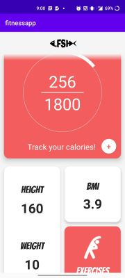
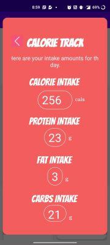
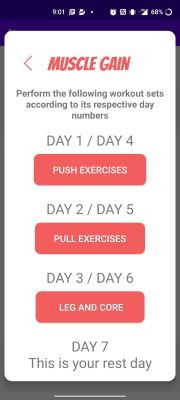

# Description

This is a very basic application for android, which helps user track his/her calories and follow workout routines suggested by our team!

User can look for workouts in the workout recommendation section, and can track calories in the main page.

# Technologies used

* Kotlin
* Firebase Auth
* Room
* Figma

# Developers

Kaushik Mahesan and Ashwin Raja

# Testing and Documentation

Harikrishnaa S

# Preview

    
